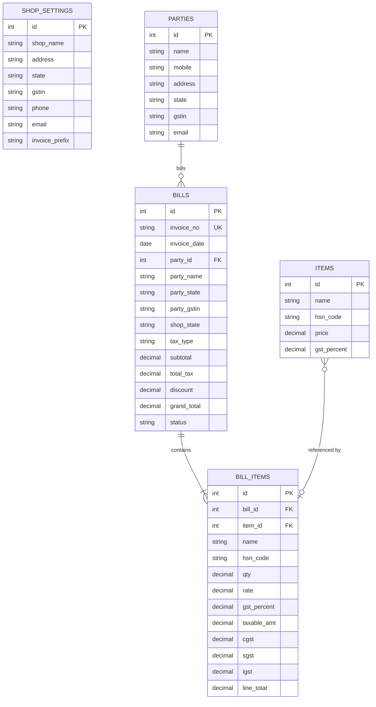

# DARSHAN UNIVERSITY
## Department of Computer Engineering
### Mobile / Web Application Development Practical Task Report
# Project Title: GST Billing System for Retail Businesses

---

## 1. Executive Summary & Objective

The **GST Billing System** is a full-stack web application developed to modernize and streamline billing operations for small and medium retail businesses. Manual bill preparation or spreadsheet-based invoicing is prone to calculation errors, especially when dealing with dual tax splits (CGST & SGST for intrastate sales) versus single tax splits (IGST for interstate sales).

This application solves these pain points by offering:
- Centralized party (customer) management with individual billing history.
- Reusable product catalog with preset GST tax slabs (0%, 5%, 12%, 18%, 28%).
- Automated GST computation engine with state-matching rule detection.
- Sequential immutable invoice generation.
- Dynamic downloadable/printable PDF tax invoices complete with Indian Currency Amount in Words.
- CSV data export and business dashboard analytics.

---

## 2. Technology Stack

| Layer | Technology | Purpose & Usage |
| :--- | :--- | :--- |
| **Frontend Framework** | **React 18 + Vite** | Single Page Application (SPA) architecture with instant HMR and rapid rendering. |
| **UI & Styling** | **Bootstrap 5 + Bootstrap Icons** | Responsive, clean, minimal layout with glassmorphic cards and modal dialogs. |
| **HTTP Client** | **Axios** | REST API communication with Express backend. |
| **Backend Framework** | **Node.js + Express.js** | RESTful API server handling routing, tax computation, and PDF streaming. |
| **Database Engine** | **Neon Cloud PostgreSQL** | PostgreSQL instance hosted on Neon (`sslmode=require`) for cloud persistent storage. |
| **Database Driver** | **`pg` (node-postgres)** | Connection pooling with SSL support and schema auto-migrations on boot. |
| **PDF Generation** | **PDFKit** | Vector-based PDF generation engine for GST tax invoice creation. |

---

## 3. Database Schema & Data Model

The application utilizes 5 relational tables designed for immutability and snapshot accuracy:



---

## 4. GST Tax Calculation Logic

The system automatically detects whether a transaction is **Intrastate** or **Interstate** by comparing the **Shop State** (configured in Shop Settings) with the **Party State**:

1. **Taxable Amount Calculation**:
   $$\text{Taxable Amount} = \text{Rate} \times \text{Quantity}$$

2. **State Rule Evaluation**:
   - **Case A: Same State ($\text{Party State} = \text{Shop State}$)** $\rightarrow$ **Intra-State Sale (CGST + SGST)**
     $$\text{CGST \%} = \frac{\text{GST \%}}{2}, \quad \text{CGST Amount} = \text{Taxable Amount} \times \frac{\text{CGST \%}}{100}$$
     $$\text{SGST \%} = \frac{\text{GST \%}}{2}, \quad \text{SGST Amount} = \text{Taxable Amount} \times \frac{\text{SGST \%}}{100}$$
     $$\text{IGST Amount} = 0$$

   - **Case B: Different State ($\text{Party State} \neq \text{Shop State}$)** $\rightarrow$ **Inter-State Sale (IGST)**
     $$\text{IGST Amount} = \text{Taxable Amount} \times \frac{\text{GST \%}}{100}$$
     $$\text{CGST Amount} = 0, \quad \text{SGST Amount} = 0$$

3. **Line Total & Invoice Grand Total**:
   $$\text{Line Total} = \text{Taxable Amount} + \text{CGST Amount} + \text{SGST Amount} + \text{IGST Amount}$$
   $$\text{Subtotal} = \sum \text{Taxable Amount}$$
   $$\text{Total Tax} = \sum (\text{CGST} + \text{SGST} + \text{IGST})$$
   $$\text{Grand Total} = \max(0, \text{Subtotal} + \text{Total Tax} - \text{Discount})$$

---

## 5. Modules & Functional Description

### 5.1 Party (Customer) Management
- **Add/Edit/Delete**: Create customer profiles with Name, Mobile, Address, State, GSTIN, and Email.
- **Searchable List**: Instant client-side search by name or mobile number.
- **Single Party Bill History**: Modal view displaying total transactions, invoices, and status history for any selected party.

### 5.2 Item Catalog Management
- Reusable product list storing HSN/SAC codes, base prices, and standard GST slabs (0%, 5%, 12%, 18%, 28%).
- Visual GST slab badges in catalog view for fast auditing.

### 5.3 GST Bill Creation
- Party selection with instant Intrastate vs Interstate state-match detection.
- Quick-Add Party inline modal without interrupting bill creation workflow.
- Item picker auto-filling rate, HSN, and GST slab.
- Per-bill discount field and payment status selector (`Paid`, `Unpaid`, `Partial`).
- Immutable bill saving with auto-incrementing sequential invoice numbers (`INV-1001`, `INV-1002`, etc.).

### 5.4 PDF Invoice & Export
- Professional PDF invoice with shop header, party details, item table, tax breakdown, and Indian Currency **Amount in Words**.
- Instant PDF downloading, browser printing, WhatsApp share links, and CSV export.

### 5.5 Business Dashboard & Analytics
- Live metrics: Total Sales, Total Tax Collected, Total Invoices Generated, Month's Sales, and Recent Invoices table.

---

## 6. Verification & Sample Deliverables

As required by submission guidelines, 3 sample PDF bills were generated and stored in the `sample_invoices/` directory:

1. `sample_invoices/Sample_Invoice_INV-1004.pdf`: Intrastate sale to Patel Retail Pvt Ltd (Gujarat $\rightarrow$ Gujarat), split into equal CGST + SGST.
2. `sample_invoices/Sample_Invoice_INV-1005.pdf`: Interstate sale to TechWave Solutions (Gujarat $\rightarrow$ Maharashtra), taxed under IGST.
3. `sample_invoices/Sample_Invoice_INV-1006.pdf`: Intrastate sale to Shreeram Traders with trade discount applied.

---

## 7. Clean Setup & Execution Instructions

### Prerequisites
- Node.js (v18 or higher)
- npm

### Step 1: Clone & Setup Backend
```bash
cd backend
npm install
npm start
```
*Note: The backend automatically connects to Neon Cloud PostgreSQL database and creates tables if they do not exist.*

### Step 2: Setup & Run Frontend
```bash
cd ../frontend
npm install
npm run dev
```

Open your browser at `http://localhost:5173` to access the full application.

---
*Submitted as part of Darshan University Mobile / Web Application Development Practical Task.*
